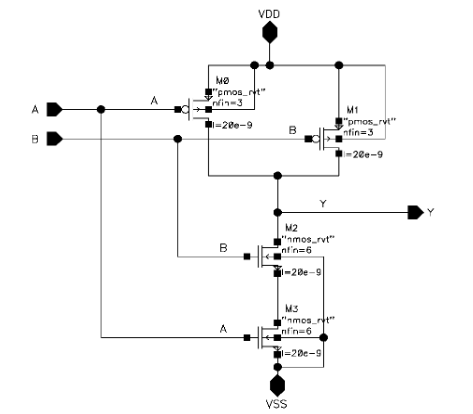
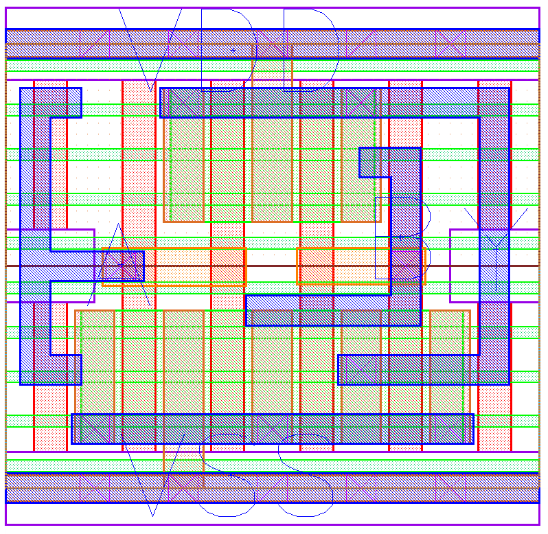
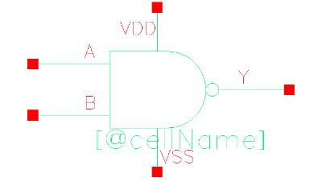

## Cell Library Development

A cell library is a characterization of commonly used logic components at the circuit level. During logic synthesis, which will be discussed later, both technology-independent and technology-dependent optimizations are performed. Following technology-independent optimizations, technology mapping occurs to allow for the technology-dependent mappings, which require knowledge of component characteristics. Technology mapping uses the cell library to associate each low-level logic gate and component of the recently generated technology-independent netlist with a real world implemented and characterized version of the component. The characteristics of these components, as mentioned previously, are used to perform simulations and physical design validation later on.

There are a few types of cells that are required for inclusion in a standard cell library. First, a cell library should have standard combinational logic cells including the basic gates and an inverter. A good cell library will have a few types of each component with different characteristics (delay, drive strength, and power consumption). Libraries also have sequential cells such as latches and flip flops as well as buffers, and integrated clock gaters.

Figure 2. The schematic view of a two input nand gate.

As with all components that are integrated into manufacturable circuits, each cell has a layout view, schematic view, and symbol view. As can be seen in figure 2 above, all of the transistors are spec’d out and ready for SPICE simulations which are typically run later in the process. Figure 3  depicts an example of the layout view for a two input nand gate. This layout view is just a standard component footprint. Finally, figure 4 shows the schematic view of the component in figure 2 and 3. In addition to these requirements, each cell in a library must have a behavioral model, an HDL model, a detailed timing model, a test strategy, a cell icon, and a wire-load model. The behavioral model of a cell is a description of its performance over time. Very simple gates such as logic gates can be automatically tested, but more involved cells require a strategy for production testing within the context of the larger system. The wire-load model is a look-up table that dictates the parasitic capacitance of the net of a cell. 

Figure 3. The layout view of the two input nand gate presented in figure 2.

Figure 4. The symbol view of the two input nand gate highlighted in figures 2 and 3.

With a preliminary cell library, a detailed timing model needs to be found through cell characterization. It is usually too expensive to test the physical components for timing as well as other relevant characteristics, so detailed simulations of the components are performed, using the known parasitic resistance as well as capacitance measurements to determine the switching delay of each component. Simulations are also performed to determine the power consumption, logic function, and load capacitances of each cell.

It is important to have in mind the physical requirements of a system, because standard, commercially available cell libraries should be used unless there is a clear reason to manually design a cell library. Typically, FPGA manufacturers provide extensive cell libraries that are usable for most applications. Many chip manufacturing companies, however, prefer to have company-specific cell libraries, that more specifically fit the needs of their product.

## [Homepage](index.md)

