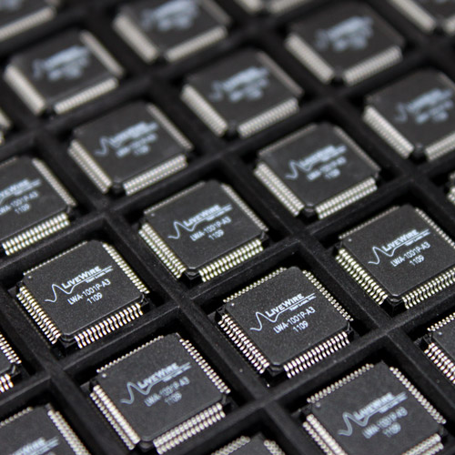

## Design Brief

FPGAs are commonly used because they are useful for education, iterative testing, and early design validation. In addition, for small scale applications, they can be a lot cheaper to manufacture than ASICs. Finally, the time to market is a lot shorter than with ASICs. However, at scale ASICs are a lot cheaper, perform better, consume less power, and are smaller. Depending on the application, either of these solutions can be appropriate (if anything, some combination of both is appropriate).

As was mentioned previously, an engineer who knows how FPGA design fits in with ASIC design is empowered because they have the understanding required to control every step in the process as well as every type of decision they could potentially need to make. Most of the time, this engineer will not need control over every step in the process, but having this knowledge gives him or her an understanding of how things can be optimized when necessary. 

If you are interested in learning even more about ASIC design, there is a lot we did not cover here. For example, technology mapping is a fantastically complicated problem that we only briefly touched on. In working on this project, we stumbled upon a lot of great resources that gave more detail than we could possibly hope to convey here. Please check our references for further readings.

## [Homepage](index.md)

