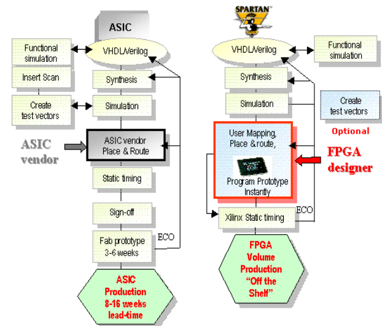

## Introduction

At the heart of computer architecture is the study of digital design iteration and optimization. In the early stages of digital design, high-level hardware description languages such as verilog and VHDL are used with FPGAs to rapidly build and test a design with other critical subsystems. In developing designs at this level, engineers are typically blackboxing the very low-level details associated with chip development in favor of validating the architecture of the actual design. However, as digital designs are preliminarily validated, the details of the full VLSI development process becomes more important.

The chip design process is heavily informed by the types of ASICs available as well as how these types of ASICs are used for different applications. The first type of ASIC is the full-custom ASIC. These chips are usually intended for scaled applications where the chip will be mass-produced because at scale these chips have the lowest cost and highest performance. However, the design cost and complexity is much higher than that of other types of ASICs. Some examples of full-custom ASICs are microprocessors, sensors, and many custom communication chips. 

Semi-custom ASICs are typically available from manufacturers such as Xilinx that provide a programmable device with standard cell libraries and well characterized logic cells. Semi-custom ASICs are marked by their use of some amount of predesigned logic. However, semi-custom ASICs range from standard-cell based ASICs that still have completely customized layout and an involved manufacturing process to ASICs that rely more heavily on predesigned logic and layout algorithms.  

Although there are prebuilt algorithms and libraries to support even beginners in the chip design process, the engineer who understands the full ASIC design process as well as the algorithms and libraries that commonly support this process has the power to build the smallest and most powerful ICs possible. Before a digital design is synthesized to produce a netlist, an engineer needs to build and characterize a cell library that is used in mapping generic gates and components included in the generically synthesized netlist to actual cells with footprints and timing characteristics. Characterizing the cell library usually involves extracting layout parasitics as well as performing static timing analysis. This information is used later in the design process during technology mapping as well as post-layout static timing analysis, physical verification of the layout, and simulation of the final design. 

Figure 1. A side by side comparison of the ASIC and FPGA development processes as set out by Spartan. It is important to note that companies typically have specific design pipelines for both types of development using their resources and platforms. This is just an example of one.

Following the development of the cell library, a technology-dependent netlist is generated through logic synthesis. During this step, technology mapping happens, allowing the synthesizer to perform technology-independent and technology-dependent optimizations. With the actual netlist optimally generated, physical placement and layout of logic cells occurs. In this part of the process, primary tasks include system partitioning and floorplanning. With low-level hardware design and layout determined, three different types of system validation are performed to confirm the functionality and performance of the designed chip(s). These types of validation include post-layout static timing analysis, physical verification of the layout, and simulation of the final design. 

On the pages that follow, we will elaborate on the critical steps in VLSI highlighted above. We will also discuss design considerations with the intention of guiding the chip design process at both a high and low level. Questions and comments on this content should be directed to bryan.m.werth@gmail.com. We are excited to hear any feedback that readers might have.

## [Cell Library Development](cell_library.md)
## [Logic Synthesis](logic_synthesis.md)
## [Physical Layout](physical_layout.md)
## [Conclusions](conclusions.md)
## [References](references.md)
