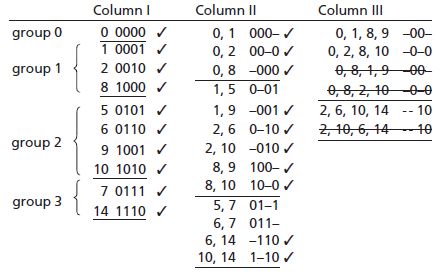
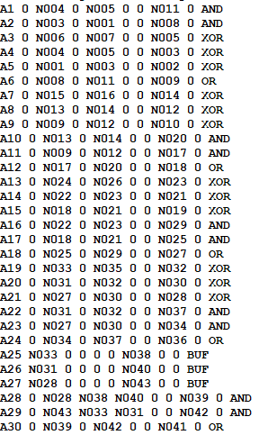
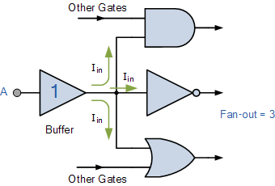

## Design Brief

Logic synthesis is the process by which a netlist is produced from HDL. This is also the part of the chip design process where the cell library is integrated with the netlist and netlist optimizations occur. In a general sense, logic synthesis produces a result that is ready for physical layout and validation. It is important to note that it is impossible to guarantee an optimal netlist.

Netlist generation is very similar to compiling a piece of software in that it involves using higher level code to produce something low-level that can be understood by the target device. In this case, a design written in a hardware description language is used to produce a circuit made up of interconnected low level sequential and combinational blocks. These netlists are generated from the bottom up in the design hierarchy. Initially, the netlist generation is simple interpretation of hdl to produce technology independent usable netlist.

Figure 5. An example of the performance of the Quine-McCluskey method for two-level boolean minimization. Functionally this method is the same as Karnaugh maps, but it is easier to implement in software.

With an initial netlist generated, technology independent optimizations are performed. This type of optimization involves using abstract cost to design area and delay to derive an optimized netlist consisting of generic gates. It is advantageous to reduce the size of the problem as much as possible before starting the technology-dependent optimizations, although none of these are actually completely technology independent. At the highest level, two-level boolean minimizations are performed at this stage, although in many cases designers have already done some of this in the process of designing. Two-level boolean minimization is based on the assumption that reducing the number of terms and size of each term will result in a smaller and faster implementation. For example, karnaugh maps is a strategy used at this stage that we have explored in class. The Quine-McCluskey Method is functionally identical to karnaugh mapping, but is easier used autonomously because of its less visual, more table oriented process. In addition, finite-state machine optimizations typically occur here. These algorithms look for FSMs that produce the same output with fewer states. More specifically, an FSM optimizer will search for states that have the same externally observed behavior. It combines these types of states until there are no cases left to combine. In addition, FSM states are encoded to save storage space as well as space required for logic implementation. 

Figure 6. An example of a netlist for an adder highlighted in our presentation. Standards for netlists vary between companies, so this is just one type of netlist.

With a technology-independent optimization of the netlist, a technology mapping algorithm will associate defined components in the provided cell library with parts of the netlist. As previously mentioned, a good cell library will have a variety of functional components that can serve the same purpose. For this reason, a typical technology mapping algorithm will attempt to optimize one or more properties of the design such as area, speed, and/or power dissipation. Optimization algorithms of varying complexity and reliability exist for use in this task. However, technology mapping is a very hard problem that is currently impossible to optimize for minimum delay or area in the presence of large gate libraries, complex design constraints, realistic and accurate delay models, and in the absence of interconnect load and delay information. For example, a typical technology mapper will map from input to output. If a technology mapper is trying to minimize delay, it is critical to know the capacitive load the output pin of each gate. However, this can’t be known because fanout and layout has not been decided yet. More than anything, it is important to have a mind for the desired characteristics of the design. 

With the fact that it is impossible to completely optimize, there is a need for good post-mapping technology-dependent logic transformations that can improve circuit delay, area, power, routing congestion, and signal integrity. These transformations, including gate resizing, fanout optimization, gate replication, and simple gate decomposition. Gate resizing involves switching between two library cells that have different area but identical logic functions. It is used when more accurate wire load or delay estimates become available. Fanout optimization can also be performed to optimize signal distribution using buffers. Fanout describes the number of inputs that one output can feed. To increase fanout, buffers can be used to propagate a signal without degrading the quality beyond measure. Depending on the situational requirements, the goal of fanout optimization can be to minimize delay where possible or to fix an overloading problem where necessary. Depending on the priorities of the system, gate replication can feasibly be used to optimize a design. Gate replication involves using a number of copies of a component that is driving an output that is connected as the input of a lot of other components. By reproducing a component, each copy drives one input, reducing the capacitive load and the delay of the system while increasing the area requirements. If the intention is to reduce the delay of the system, simple gate decomposition can be used to break multiple-input simple gates into two or more simple gates present in the cell library. Depending on the cell options, this sometimes reduces delay.

Figure 7. A schematic example of fanout. The output of the buffer is feeding the other three components inputs.

There are a lot of decisions that can be made at the time of design synthesis that can significantly influence the strengths and weaknesses of a final physical design. For this reason, it is critical to understand the decisions that can be made at this stage of chip development. With that said, it is also important to understand that there is no perfect solution to the problems presented in synthesis, so designers should prioritize what they know is important while having a mind for the bare minimum requirements of the system. 

## [Homepage](index.md)

