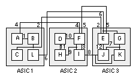

## Physical Layout

Once the optimized technology-dependent netlist is produced, physical layout is performed. Sub-processes considered during this final stage are partitioning, power dissipation, floorplanning, and simulation of the final design. Partitioning is the process of splitting a design into partition cells in the most efficient way. Typically, designers seek to minimize the number of connections between partition cells, but there can be other goals in partitioning as well. Constructive partitioning involves starting from scratch to develop partitions. One of the main types of constructive  partitioning is seed growth. In seed growth, a designer starts a new partition with a seed logic cell. Here, the logic cell with the most connections makes the best seed logic cell. After, the designer considers all of the logic cells that are not yet in the partition, developing a gain function that measures the benefits of adding a logic cell to the current partition. In this situation, the gain function can be based on the number of connections to components already in the partition cell. The logic cell with the highest gain is added to the partition cell. Following this, the process is repeated until the current partition cell fills, after which the whole process starts over with a new partition cell. 

Figure 8. A simple example of partitioning. A common goal of partitioning is to minimize the number of connections between partitioning cells (ASIC 1, ASIC 2, and ASIC 3).

Iterative partitioning improvement can also be used to improve an existing solution. The interchange method of iterative partition improvement involves swapping a single logic cell at a time. The swap is accepted only if the change improves the partition. A greedy interchange method algorithm would consider only one change at a time, accepting the moving only if it provides immediate benefit. Group migration algorithms are more complicated, but are also better at improving solutions. The Kernighan-Lin algorithm swaps cells between the two clusters by checking to see whether the swap improves the gain function. If it does, the swap is made and the two components are locked. This swapping continues until every node is locked and the design is sufficiently optimized. Other common group migration algorithms include hypergraph, fiduccia-mattheyses algorithm, look-ahead algorithm, and simulated annealing. 

As is briefly mentioned above, there are a few common objectives of partitioning. First, certain logic cells need to be close to each other to keep the delay of external connections to a minimum. In these cases, engineers compensate for these timing constraints by adding weights to certain nets to make them more important when considered by the gain function. In addition, some logic cells consume more power than others. To account for this consideration, rough estimates of power consumption should be calculated early and factored into the gain function. Other constraints that designers have to keep in mind are technology constraints, cost constraints, and test constraints (it is important to maintain observability and controllability). 

Floorplanning is the placement of the components with their designated partition cells. It is considered to be the most important part of physical layout because it directly affects the routability and timing of the final design. Floorplanning is similar to PCB design in that it is gradually performed by moving from high level considerations to low level considerations. Before any actual cells are placed, size of the block, power domain design, and IO placement are all decided. It is notable that power dissipation across the cell should be considered in conjunction with floorplanning to ensure that all parts of the cell can get the power required. The two types of power dissipation to consider are dynamic power dissipation and static power dissipation. Switching current from charging and discharging parasitic capacitance as well as short-circuit current when both n-channel and p-channel transistors are momentarily on at the same time are two major causes of dynamic power dissipation while subthreshold and leakage current are two types of static power dissipation. Following these considerations, cells are gradually placed and routing takes place.

After physical layout design is completed, post-layout static timing analysis, physical verification of the layout, and simulation of the final design is completed. Static timing analysis is done to confirm that data moves in lockstep (on the tick of the clock signal). If it does not, engineers could either see a max time violation, which means the data arrived too late for the clock edge, and a min time violation, which means the data arrived too early after the clock’s active transition. Although checking for these timing violations is generally the primary purpose of static timing analysis, problems such as glitches, slow paths, and clock skew can also be detected. Physical verification of the layout involves confirming that the design is electrically correct and logically functional. Electronic design automation software can be used to complete these tests before an actual simulation of the final design is run.

## [Homepage](index.md)

